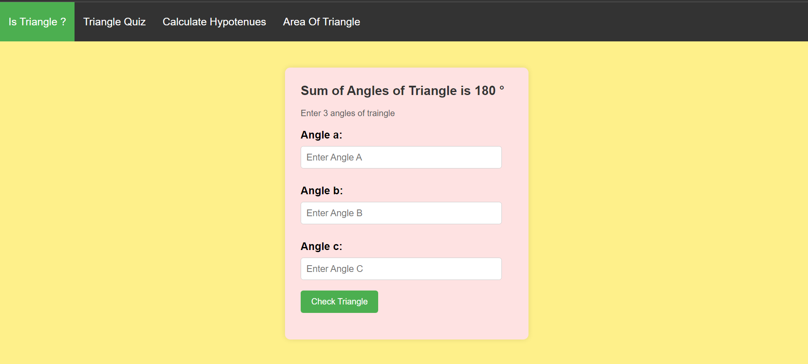
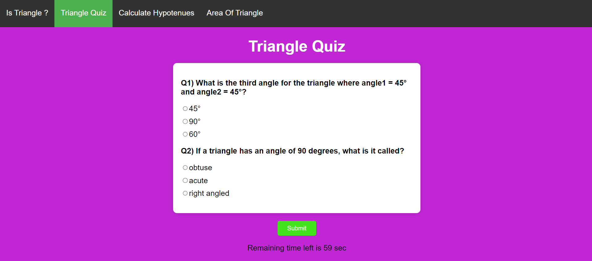
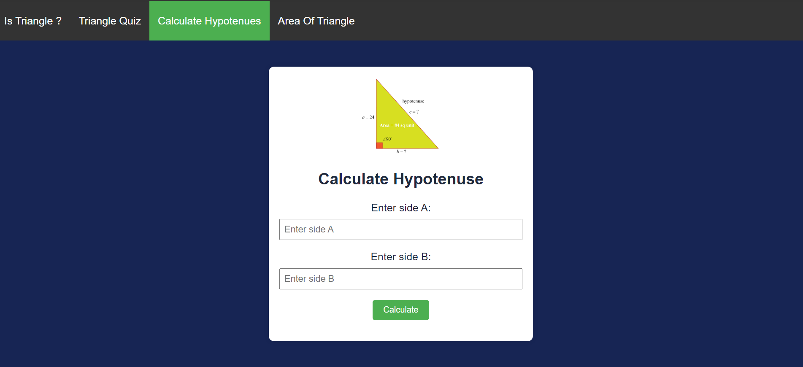
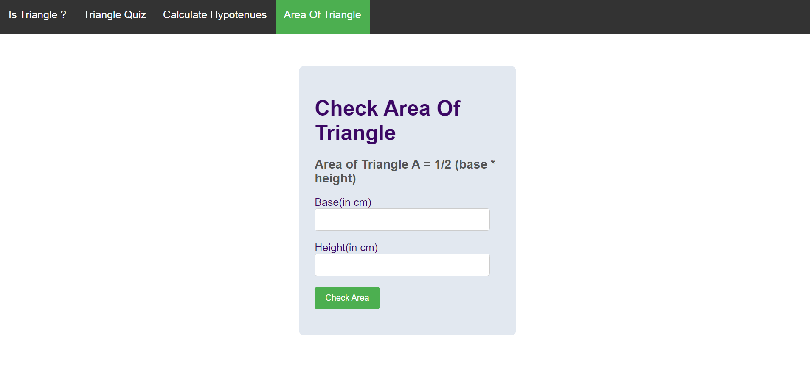

# Is Triangle
By Sourabh Pande

---

## Overview
It web app, related to Triangle to help you clear your all basic concept of Triangle, 
created with HTML, CSS, and JavaScript, calculates triangle areas using formulas, the Pythagorean theorem, and offers quizzes on triangles, built using pure JavaScript.

---

## Technologies Used
- JavaScript
- HTML
- CSS

---

## Live Demo

---

## Preview

